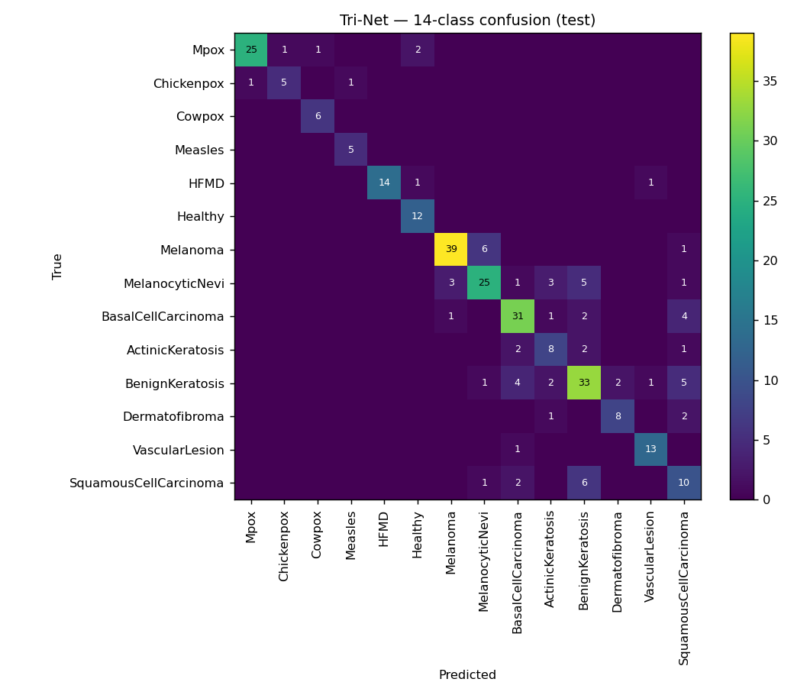
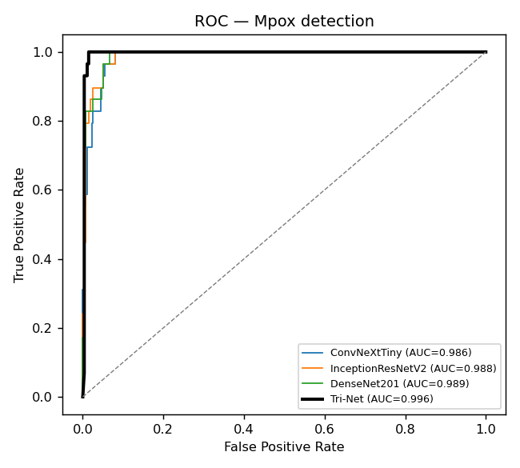
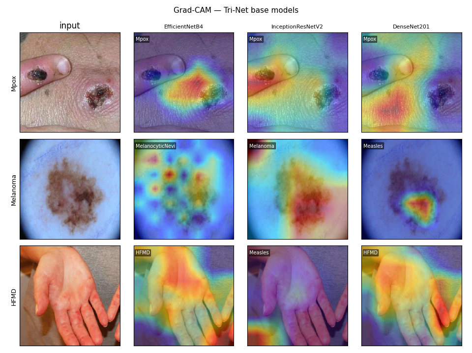

<div align="center">

 

# Tri-Net v2

**Official implementation of the paper**
### Tri-Net: Unified Deep Learning for Skin Lesion and Symptom-Based Monkeypox Detection

A reproducible deep-learning **framework** for Mpox and skin-lesion classification — modern CNN
backbones, feature-level fusion, explainability, benchmarking, and clinical evaluation.

[](https://pypi.org/project/Mpox-Trinet/)
[](https://github.com/Sudharsanselvaraj/Synergistic-Deep-Learning-for-Monkeypox-Diagnosis/releases)
[](https://github.com/Sudharsanselvaraj/Synergistic-Deep-Learning-for-Monkeypox-Diagnosis/actions/workflows/tests.yml)
[](https://www.python.org/)
[](https://www.tensorflow.org/)
[](LICENSE)
[](#code-availability)

**[Overview](#overview) • [Install](#installation) • [Quick Start](#quick-start) • [Python API](#python-api) • [CLI](#cli-commands) • [Results](#benchmark-results) • [Paper](#original-publication) • [Citation](#citation)**

</div>

> **Tri-Net** is the published *method*; **Tri-Net v2** is the open-source *software framework* that
> implements it, so the code can evolve independently of the paper across future releases.

---

## Overview

**Tri-Net v2** is an open-source research framework for reproducible Mpox and skin-lesion
classification. It provides complete **training, evaluation, explainability, benchmarking, and
inference** pipelines built on TensorFlow and modern CNN architectures, and reports two clearly
separated tasks: **14-class fine-grained diagnosis** and **binary Mpox screening**. Every figure
and number is regenerated from code on a strictly **leakage-free** split — nothing is hand-typed.

## Key Features

- Reproducible, leakage-free training & evaluation pipeline
- Modern backbones — **ConvNeXt-Tiny**, **DenseNet201**, **InceptionResNetV2**, EfficientNet(B4/V2-S)
- **Feature-level fusion** (Concat-MLP / attention / transformer) + PSO / Mean ensembles
- Separate **binary Mpox screening** task with sensitivity/specificity + confidence intervals
- **Grad-CAM** explainability
- 5-fold cross-validation, McNemar's test, Cohen's κ, ensemble-diversity analysis
- Installable **Python package** + unified **command-line interface**
- **Docker** support, GitHub Actions CI, and a model zoo with downloadable weights

## Original Publication

> **Tri-Net: Unified Deep Learning for Skin Lesion and Symptom-Based Monkeypox Detection**
> Sudharsan S¹ · Prabu Selvam²ᵗ · Nirmala Veeramani³ᵗ · Kiran Kumar B⁴ · Nikola Ivković⁵ · Korhan Cengiz⁶,⁷
> ¹²⁴ School of Computing, SRM Institute of Engineering and Technology, Tiruchirappalli Campus, India · ³ School of Computing, SASTRA Deemed University, India · ⁵ Faculty of Organization and Informatics, University of Zagreb, Croatia · ⁶ College of Computing and Intelligent Systems, University of Khorfakkan, UAE · ⁷ Department of Electrical Engineering, Biruni University, Istanbul
> ᵗ Corresponding authors

**Status:** currently under peer review at ***Scientific Reports*** (Springer Nature, Nature
Portfolio); both reviewers have recommended the manuscript for acceptance. This repository is the
code artifact referenced by the manuscript's **Code Availability** statement. It is a from-scratch,
tested, reproducible implementation that keeps the paper's core idea — a Tri-Net ensemble plus a
symptom-based classifier — and makes every reported number independently verifiable. The original
study scripts are preserved unmodified under [`archive/`](archive/) for provenance.

## Installation

```bash
pip install mpox-trinet
```

The package installs as **`mpox-trinet`** and imports as **`trinet`** (with a `trinet` CLI). On
Apple Silicon, add the Metal extra: `pip install "mpox-trinet[metal]"`. For development from a
clone: `pip install -e ".[dev]"`.

## Quick Start

```bash
trinet doctor           # environment & readiness diagnostics
trinet download         # download datasets (needs a Kaggle API token)
trinet prepare          # leakage-free 14-class split + clean symptom data
trinet features         # cache frozen-backbone features
trinet fusion           # train the fusion model (deploys the verified champion)
trinet predict image.jpg
```

Run the whole image pipeline in one shot with `trinet benchmark`, or regenerate every artifact
with `trinet reproduce`. Full reference: `trinet --help`.

## Python API

```python
from trinet.inference.predict import predict_image

result = predict_image("lesion.jpg")
print(result["diagnosis"])       # e.g. "Mpox"
print(result["confidence"])      # e.g. 0.83
print(result["mpox_screening"])  # {"label": "Mpox", "mpox_probability": 0.83}
```

Or use the library directly:

```python
from trinet.models.fusion import build_concat_mlp
from trinet.evaluation.metrics import compute_scores
```

## CLI Commands

| Command | Description |
|---|---|
| `trinet doctor` | Environment & readiness diagnostics |
| `trinet download` | Download datasets from Kaggle |
| `trinet prepare` | Build leakage-free train/val/test splits |
| `trinet features` | Cache frozen-backbone features |
| `trinet train` | Train per-backbone classification heads |
| `trinet fusion` | Train the fusion model + deploy the verified champion |
| `trinet predict` | Run inference on an image |
| `trinet explain` | Generate Grad-CAM explanations |
| `trinet benchmark` | Run the full image pipeline |
| `trinet reproduce` | Reproduce all experiments and figures |
| `trinet export` | Export the model (SavedModel / ONNX) |

## Benchmark Results

Fine-grained **14-class** classification on the held-out, leakage-free test set (regenerated by
`trinet evaluate --champion`):

| Model | Accuracy | Macro-F1 | AUC |
|---|---:|---:|---:|
| EfficientNetB4 | 58.4 | 63.3 | 95.0 |
| DenseNet201 | 66.3 | 67.2 | 95.6 |
| InceptionResNetV2 | 68.0 | 68.8 | 96.2 |
| ConvNeXt-Tiny | 69.3 | 70.3 | 96.5 |
| Mean Ensemble | 75.3 | 77.2 | **97.1** |
| **Concat-MLP fusion** | **77.2** | **79.1** | 97.0 |

> 14 classes, leakage-free 80/10/10 split, ~3,000 real images — a substantially harder setting
> than the binary or low-cardinality tasks common in the Mpox imaging literature. Full tables,
> cross-validation, and ablations: [`docs/benchmark.md`](docs/benchmark.md).

### Binary Mpox Screening

The clinically-actionable "is this Mpox?" formulation:

| Metric | Score | 95% CI (Wilson) |
|---|---:|---|
| Accuracy | 98.35% | 96.2 – 99.3 |
| AUC | 99.58% | — |
| Sensitivity | 86.2% | 69.4 – 94.5 |
| Specificity | 99.6% | 98.0 – 99.9 |

## Figures

<div align="center">


<br>

<p><sub>14-class confusion matrix · ROC for Mpox detection · Grad-CAM — all regenerated from code.</sub></p>
</div>

## Repository Structure

```
configs/       YAML experiment presets
docs/          architecture, datasets, benchmark, reproducibility, model zoo, roadmap
examples/      runnable usage examples
experiments/   one-off studies (e.g. binary screening with Wilson CIs)
scripts/       shell helpers
src/trinet/    installable package — datasets, models, training, evaluation, inference, CLI
tests/         unit tests (metrics, models, fusion, checkpoint integrity)
archive/       original Tri-Net scripts, preserved for provenance
```

## Reproducibility

Seeded (`42`), deterministic, leakage-free split; metrics on the held-out test set only;
generated artifacts (`outputs/`, `data/`) are git-ignored and regenerated by the CLI.

```bash
trinet download && trinet prepare && trinet features
trinet train && trinet fusion && trinet evaluate --champion
trinet cross-val && trinet diversity && trinet gradcam
```

Reference environment: Python 3.11, TensorFlow 2.16.2. Full notes (incl. Apple-Metal specifics):
[`docs/reproducibility.md`](docs/reproducibility.md).

## Code Availability

This repository is the code artifact referenced in the manuscript's Code Availability statement,
as required by *Scientific Reports*' policy on custom computational tools. Recommended statement:

> The custom code, trained model weights, and evaluation pipeline supporting the findings of this
> study are openly available at
> [github.com/Sudharsanselvaraj/Synergistic-Deep-Learning-for-Monkeypox-Diagnosis](https://github.com/Sudharsanselvaraj/Synergistic-Deep-Learning-for-Monkeypox-Diagnosis)
> and on PyPI (`pip install mpox-trinet`), archived on Zenodo at DOI: *pending — archive a tagged
> release via the GitHub–Zenodo integration to mint one*.

To mint the DOI: connect the repo to Zenodo (Zenodo -> GitHub -> toggle this repo on, then publish a
release), and add the resulting DOI badge here and to the manuscript.

## Citation

The study is currently **under revision at *Scientific Reports* (Springer Nature)**; a DOI will be
added upon acceptance. Please cite the manuscript and this software framework:

```bibtex
@article{selvaraj2026trinet,
  title   = {Tri-Net: Unified Deep Learning for Skin Lesion and Symptom-Based Monkeypox Detection},
  author  = {Selvaraj, Sudharsan and Selvam, Prabu and Veeramani, Nirmala and
             Kumar B, Kiran and Ivkovi{\'c}, Nikola and Cengiz, Korhan},
  journal = {Scientific Reports},
  publisher = {Springer Nature},
  year    = {2026},
  note    = {Under revision. DOI to be added upon acceptance.}
}

@software{trinet_v2_2026,
  author  = {Selvaraj, Sudharsan},
  title   = {Tri-Net v2: A Reproducible Deep-Learning Framework for Mpox Skin-Lesion Diagnosis},
  year    = {2026},
  url     = {https://github.com/Sudharsanselvaraj/Synergistic-Deep-Learning-for-Monkeypox-Diagnosis}
}
```

See **[`CITATION.cff`](CITATION.cff)** for the machine-readable entry.

## Acknowledgments

Built on the MSLD v2 and ISIC skin-lesion datasets and the Kaggle Monkeypox symptom dataset —
full sourcing and licensing in [`docs/datasets.md`](docs/datasets.md).

## License

Released under the [MIT License](LICENSE). Research artifact — **not a medical device**; not for
clinical use without regulatory approval and prospective validation.
